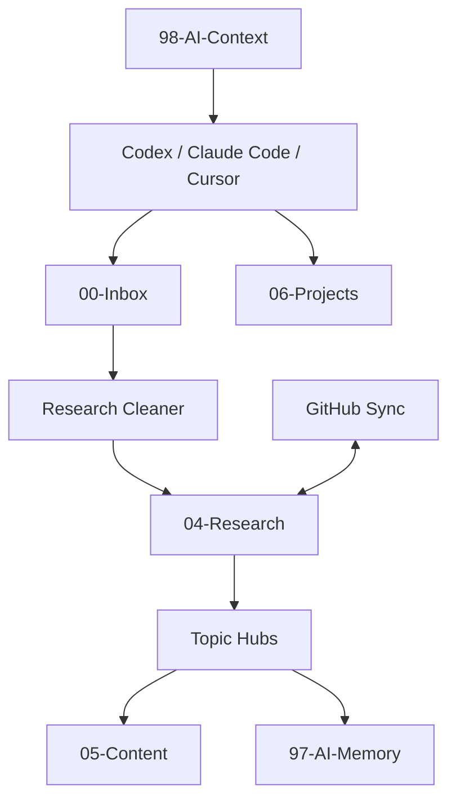

# Knowledge Map

```mermaid
flowchart TD
  Inbox["00-Inbox"] --> Cleaner["Research Cleaner"]
  Cleaner --> Research["04-Research"]
  Research --> Topics["Topic Hubs"]
  Topics --> Content["05-Content"]
  Topics --> Memory["97-AI-Memory"]
  Context["98-AI-Context"] --> Agents["Codex / Claude Code / Cursor"]
  Agents --> Inbox
  Agents --> Projects["06-Projects"]
  GitHub["GitHub Sync"] <--> Research
```

